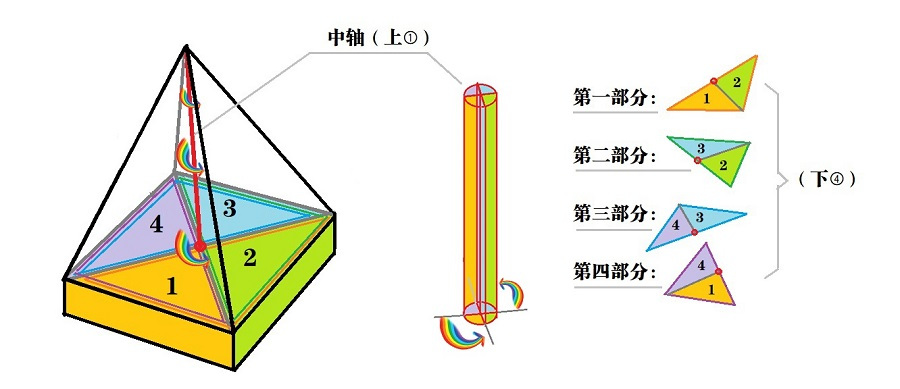

# 意识强度检测点（8）右上区：灵性结构区

（2018-2019年第三版）

【元吾氏催醒法研究】

----------目录----------

- 第一层区域：底层区域
    - 一、小型螺旋对流结构
        1. 树形拓扑结构
        2. 星型拓扑结构
        3. 珠线型拓扑结构
    - 二、环线型双平行结构
        1. 瞬结型网状结构
        2. 主导型拖压式结构
- 第二层区域：上层区域
    1. 金字塔结构
       1. 金字塔第一部分
       2. 金字塔第二部分
       3. 金字塔第三部分
       4. 金字塔第四部分
    2. 底盘结构

--------

# 【八】右上区：灵性结构区

自体灵性结构呈波浪形。

内在分两层区域：底层区域和上层区域。

底层区域是T组*重点研究的部分。

T组在这个区域的检测点有很多，但实用上实际只选取一部分。

这种选择是按照当前的形势来定，并非是一成不变的。

目前更新的大概有十来个点位。

*关于T组，请参考元吾氏另一篇文章《轮回是否存在》。

## 第一层区域：底层区域

**量化数据（信息传输率）：**

人类普遍大部分20%~40%。

### 一、小型螺旋对流结构

结构公式：x=bn²t。

**有3个结构。**

#### 1. 树形拓扑结构

此结构呈树形拓扑状，延伸出两条支线，连接相对应的星型拓扑结构。

这种连接容易被操控，造成无法正确连接。

其原因有3点：

1)**始端的状态混乱：**能量纠缠在一起，无法形成统一有效的传送。

2)**传送不完整：**在路径当中制造和搭建虚假的通过条件，造成信息传送不完整。

3)**在接收端制造路径误导：**造成连接错位。

以上3种情况是最为常见的。

**量化数据（点位通过率，或信息传输率）：**

人类普遍20%~40%。

#### 2. 星型拓扑结构

此结构呈星型拓扑状，核心部分接收信息后，向四周传输，维持该结构的平衡与稳定。

该结构与更深的机构联结，在向自身深层部分传递的过程中，如有干扰，则会出现各种各样的状况。
有较大干扰时，甚至会造成部分层面的循环和卡顿，以至传到更深层结构的信息所剩寥寥无几。

这个部分的关键，在于信息传递的路径。

路径错位会引发迷宫效应。

修复该结构的要点，是要重新调整信息的路径顺序。
（也是一个研究重点。）

**量化数据（信息传输率）：**

人类普遍20%~30%。

#### 3. 珠线型拓扑结构

此结构呈珠线性拓扑状，结构非常长，每一个小部分组成波浪形的形状，各部分之间有节点相连。

这些珠线上的相连节点小圆珠，像灯泡一样。
灯泡的发光度，代表能量顺利通过的比重。

每个小部分，都汇结在大的节点当中。

每种类型的灯泡，有自己特定接收的信息。

灰暗的灯泡，代表该信息没有传输到位，或者只传递了部分。

可根据灯泡的亮度不同，进行判断。

所以，该点位的数值，代表该灯泡亮度的比率。

**量化数据（灯泡亮度比，或信息传输率）：**

人类普遍20%~30%。

### 二、环线形双并行结构

结构公式：y=xmt²。

**有2个并行结构。**

#### 1. 瞬结型网状结构

此结构相当于底层的防护网，遇到能量冲突对流，会发生作用。

此作用机制，比较单一死板，不太适合目前很多干扰的情况。

此结构属于旧式系统的一部分，不能很好适应当前的新情况，作用机制需要更新换代。

该结构目前被T组做过手脚，导致无法智能升级。

清除该结构的干扰，并进行升级，是一个研究重点。

目前对该情况有3种破解对策：

1)**通过高层授权直接修改程序：**这一条较难达成。

2)**研发破除T组干扰的装置：**但是需要先全面掌握该结构的情况，目前相应的研究还不足。
全面了解之后，可以研发相应的破解装置和程序，这样可以重新激活智能升级系统。

3)**利用间谍获取T组相关技术的情报，来进行装置功效转换或者拆除：**该技术保密程度较高，不易通过普通间谍获取，需要更高级别和权限的间谍。

**量化数据（作用效果值）：**

人类普遍5%~10%。

#### 2. 主导型拖压式结构

此结构由6层芯片组成，每层芯片存储不同频率的信息。

芯片的组成结构较为灵活自由，如环形，线形和串形。

结构特点：不停穿梭游走，接收和传递信息，运动时可有瞬间幻影的效果。

此结构因为其幻影特性，较难被捕捉，T组正大力研究捕捉该结构。

（目前对该结构掌握的资料较少，正在寻找直接参与研发的人员。）

该点的数值不便于直接检测，只能通过该结构在接触两端时，进行间接检测。

检测数值是指该结构所携带的正确信息的比率。

**量化数据（正确信息比率）：**

人类大部10%~50%。

## 第二层区域：上层区域

### 1. 金字塔结构

有5种模式构成，上1下4，整体呈金字塔型结构，从中间能分成4个部分，呈层级递进的关系，有一个共同的核心轴线连接。

这个轴线是七彩流动的，每个部分对应不同的流动方式。

#### 第一部分由模式1和2构成

此中轴的流动方式为断线型流动。

此部分性能极不稳定，依赖多条底层传送线。

目前，该传送线大部分被T组操控，因此严重影响了该部分的稳定程度。

操控方式为：把原有的传送线，替换为操控方的传送线。

该手段比较隐蔽，不容易被察觉，导致人类该部位普遍受损严重。

（通过获取源传送线的扭矩传送力度，即可仿制该传送线，计算扭矩传送力度有一个公式。

目前已计算出8条传送线的数值，被操控的有十几条，主要相关参数很难获取。

其中一个最难测量的叫镊度值，此数值测量法：相应的粒子运行一步，需要连续测量两步。

但是在那一步中会发生很多变化，引发很多变量值，变量可多达十几种，造成测量困难。）

目前的破解方法：通过另外3个部分的调整，来带动这个部分的提升。

**量化数据（平均流动稳定性）：**

人类普遍15%~20%。

#### 第二部分由模式2和3构成

此心轴的运动方式为螺旋形。

这个螺旋形下到第二部分成为雾状，转变为离散结构，与该部分原有的形状结合，帮助扩张横膜阻力，进行抗压测试。

阻力两端对接时，发生碰撞火花，产生可被个体利用的动力因子。

该碰撞机制可产生3种动力因子：

1)**转移目标型：**对个体增加用来临时转换的动力因子。
当确定临时转换目标时，该动力因子可以帮助精准调整目标定位。
调整完该动力因子，可继续保存，留下次再用。

2)**促进区域联合型：**在不同区域间互动，达到联合的作用的动力因子。
互动的方式为：通过旋转让自身的能量留在其它区域，并将该区域的能量进行携带，再返回原有的区域。

3)**助力运动型：**帮助其它信息粒子运行的动力因子，并保证整体信息粒子的运行能够稳定有序。

第二部分，对整体机构的稳定，起到至关重要的作用。

其稳定性不易被破坏，是较为机械运作的部分。

**量化数据（稳定性）：**

人类普遍50%~60%。

#### 第三部分由模式3和4构成

此心轴的能量方式为垂直线性，呈S状流动。

此部分的流动，可起到清理净化的作用，可吸收并过滤掉其它部分所产生的杂质。

该部位的识别装置，受到干扰会产生清理异常。

目前的异常，主要受第一部分的影响。

该部分的功能紊乱，也会对机体造成一些影响。

主要表现为：

1)**反应空白：**个体对某些状况不知如何反应，产生无法识别，导致无法给出反应结果。

2)**思维错位：**个体在考虑A的时候，会自动考虑B，无法辨别A与B的区别。

3)**反馈错位：**个体对一件事情所得到的反馈结论，造成错位。

这3点可以独立发生，也可以延续递进地发生。

**量化数据（平均稳定性）：**

人类平均40%左右。

#### 第四部分由模式4和1构成

此心轴的流动装置为方形结构。

此部分汇集前3个部分的所有数据，传递给下一个结构。

该部分会进行最后的识别过滤，会过滤掉无效的信息，有一小部分继续参与循环。

该部分的运行较为稳定。

**量化数据（稳定性）：**

人类普遍60%~70%。

### 2. 底盘结构

此结构接收来自金字塔结构的数据，通过不同的算法机制进行分流，然后输送到个体。

底盘中间的形状，类似五角星。

这个信息分流机制，与几个因素有关：

1)**按基本属性分流：**类似金、木、水、火、土这些基本元素，按照自然规律来分流。

2)**受个体倾向影响**。

3)**受个体意图影响**。

这种分流本身，是按自然规律来分的。

当受到主观影响，就会造成一些分流的混乱。

**量化数据（分流稳定性）：**

人类普遍40%~50%。

【第8区检测点完】

-------------Disclaimer 免責聲明-------------

经验分享，仅供参考。转载自由，严禁修改。

All info is intended for experience sharing and reference only without any warranty.
Redistribution is freely permitted provided that no modification is made whatsoever.

YWS

©Copyright reserved.
