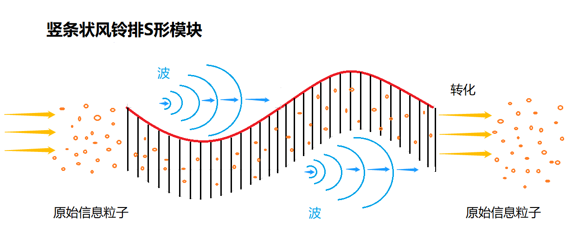
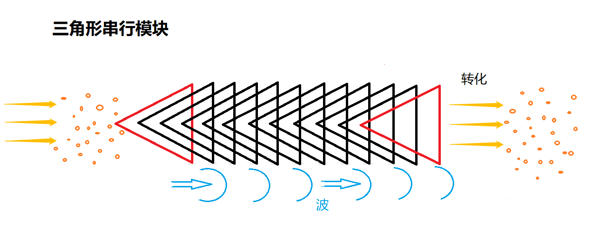
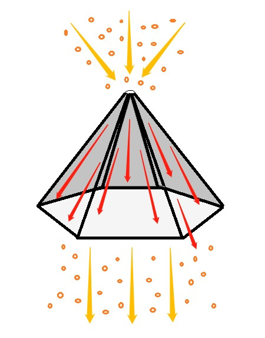
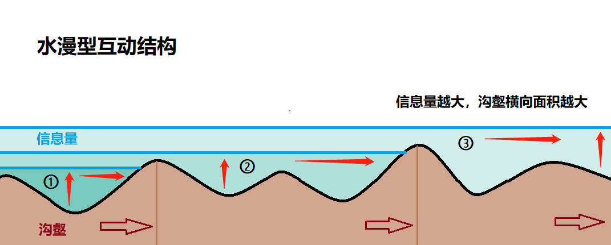
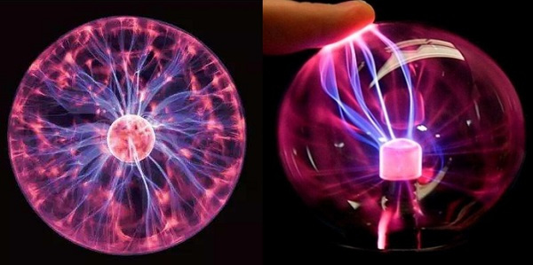

# 意识强度检测点（9）右下区：模块交换区

（2018-2019年第三版）

【元吾氏催醒法研究】

----------目录----------

- 第1部分：模块建立部分
    - 第一种：螺旋感应模块结构
        1. 波形扭转概率的稳定性
        2. 层次间的交融度
        3. 模块区域断层程度
        4. 模块运动的同步性
        5. 模块发展的联动性
    - 第二种：直线折叠模块结构
        1. 月牙形感应模块结构的建立
        2. 垂直形连接模块结构的建立
        3. 倒锥滴漏形模块结构的建立
        4. 翻滚波浪形模块结构的建立
        5. 半月递进型模块结构的建立
        6. 竖条状风铃排S形模块结构的建立
        7. 三角形串行模块结构的建立
        8. 无底金字塔型射线模块结构的建立
- 第2部分：不同模块间互动部分
    - 第一种：珊瑚状互动区域
        1. 虫节状多层次交替型互动类型
        2. 蝶状循环互动类型
        3. 桥式节梯型互动类型
        4. 几何型嵌套式互动类型
        5. 内核型扩展式互动类型
    - 第二种：沟壑型互动区域
        1. 叠片状互动结构
        2. 散射状针型互动结构
        3. 水滴状流动性互动结构
        4. 两点旋转型互动结构
        5. 针叶式串行互动结构
        6. 水帘型互动结构
        7. 水漫型互动结构
        8. 飞剑型互动结构
        9. 整体螺旋型互动结构
    - 第三种：大丽花互动区域
        - 1. 曲线描边型互动结构
        - 2. 花心放射自旋球型互动结构
        - 3. 花心放射螺旋型互动结构
    - 第四种：传音筒互动区域
        1. 单线螺旋状互动结构
        2. 点状能量聚散互动结构
        3. 多线直线互动结构
        4. 中轴线椭圆泡泡互动结构
- 第3部分：模块基底部分
    - 第一种：基底结构的搭建区域
    - 第二种：基底结构的运作区域
        1. 网状节点运作方式
        2. 弧线连接运转方式
    - 第三种：基底结构的防护区域

--------

# 【九】右下区：模块交换区

## 第1部分：模块建立部分

人体信息模块（或意识模块）的建立，有一个控制程序，叫YCCB。

此程序用来控制分层、分功能地建立相应的信息模块区域。

**此程序通过以下2种方式，来完成整体运作。**

### 第一种：螺旋感应模块结构

第一种，是在底层以螺旋感应的方式，来调整信息模块区域的结构。

包括信息模块的折叠、扭转等其它变形机制。

**有5种调整方式。**

#### 1. 波形扭转概率的稳定性

是指波形结构在通过区域信息模块时，发生一定概率的扭转现象。

正常的扭转，可让机体更好的适应各种不同的情况。

波形的正常扭转，可显化为个体不同的反应方式。

检测数值指正常扭转的稳定性，数值越高代表越稳定。

**量化数据（正常扭转的稳定性）：**

人类平均60%~70%。

#### 2. 层次间的交融度

是指不同区域信息模块之间相似的部分，会产生交互相融的现象。

此部分对个体不同机能的协调性，起到至关重要的作用。

（主要影响的机能，还可以再细分。
）检测数值指正常交融的稳定性。

**量化数据（正常交融的稳定性）：**

人类平均50%~60%。

#### 3. 模块区域断层程度

信息模块运行有正常损耗，系统会及时修补和更新受损的信息模块。

如果受到干扰，受损部分会卡住，导致无法被过滤。

这样就无法完成更新，慢慢会出现断层现象。

干扰，主要是导致受损部位的剥落机制异常，该部位会收到反向信号，从而产生拮抗效应。

需要屏蔽反向信号，机制才会恢复正常。

反向信号主要来自干扰渗透技术。

断层数的增加，会影响意识信号的传输，使得个体自由意识的影响减弱，更容易被操控。

检测数值指断层程度。

**量化数据（断层程度）：**

人类平均40%~50%。

#### 4. 模块运动的同步性

信息模块按照一定的规则去做整体性的运动，整体运行基本会做到同步有序。

不同步的信息模块区域，容易产生受损联动，会导致新的受损因素产生。

因此，信息模块修复也是较为重要的部分，也是个体提升的重要参照指标。

该数值高的话，个体发展更稳健有序。

**量化数据（同步性）：**

人类平均30%~40%。

#### 5. 模块发展的联动性

信息模块会随着运动，而得到自身的发展。

信息模块在发展过程中，会由于自身的原始力而引发削弱效应，会导致模块自动下降层级，模块的波动也会产生机能异常。

联动性，体现在模块间的合作。

模块合作机制，是根据国际通用规则来进行，该规则由人体规则委员会来制定。

该委员会总共颁布了18项规则和章程，构成人体运行的基本规律。

**量化数据（联动性）：**

人类普遍50%~60%。

### 第二种：直线折叠模块结构

第二种，是以直线折叠的方式，来建立信息模块结构。

**有8种建立方式。**

#### 1. 月牙形感应模块结构的建立

结构：月牙形，沿着蝴蝶形曲线螺旋状上升，末端分叉为5个端口，与矩形磁力结构对接，通过上层结构纽带，传送到下一个模式结构中。

功能：在周围神经系统发挥作用，捕获游离信息粒子，为建立感应新形态而输送能量。

此模式运转良好的话，个体的感应机能会更稳定。

**量化数据：**人类普遍60%~70%。

#### 2. 垂直形连接模块结构的建立

结构：垂直形、离散型结构。

功能：向外扩散信息粒子，通过调整扭矩，可对扩散的量度和角度进行调控。

从更高的角度来看：通过这种扩散方式，进行信息模块间的对接，能对接的范围很广，包容性也很强，从某些层面来说可以做很多事情。

开发和利用这些结构，可以进行一些有目的性的游戏操作。

（目前该层面研究较少，今后可能会增加相关研究。）

**量化数据：**人类普遍60%~70%。

#### 3. 倒锥滴漏形模块结构的建立

结构：倒锥形、滴漏型结构。

功能：有3层渗透结构：

第1层的功能是过滤：将一些较大的杂质粒子或者粒子团排除在外。

第2层的功能是转化：将过滤进来的杂质粒子进行打散和重组。

第3层的功能是精微化：转变为个体可以吸收的新粒子。

整个结构类似于杂质粒子的回收和转换的功能。

该结构的功能可以很好地保持个体机能的循环运行。

**量化数据：**人类普遍40%~60%。

#### 4. 翻滚波浪形模块结构的建立

结构：有几种不同的翻滚波浪形态，根据不同的反应模式进行形态的调整，整体呈链条形。

功能：反应模式有3种：

第1种：继承演化型：螺旋式翻滚。

在翻滚中接纳并吸收由外界触发而产生的信息粒子，进行发酵并演化。

第2种：对抗排斥型：闭合型翻滚。

在翻滚中撞击其它信息粒子，对机体相关运行起到较为稳定的保护作用，所以是机体必不可少的核心功能之一。

第3种：互助交换型：触角回转式翻滚。

在翻滚中接收外界信息的同时，把自体信息传递出去，并将接收到的信息传递给相应的其他部位，同时也从其它部位中获取其它的信息，从而进行这种交换互动的循环。

3种形态互相配合、呼应并合作，形成一套完整的运行机制。

该模式与人体的自然和谐的发展有关。

**量化数据：**人类普遍40%~50%。

#### 5. 半月递进型模块结构的建立

结构：半月形，递进结构。

功能：此模块有5层递进结构，是神经元等微小单位的大本营，在这里制造和重组品种繁多的微小单元，并进行调配，输送到不同的地方。

第1层：根据需要来制造不同的微小单位。

第2层：根据功能进行分类存储。

第3层：根据需求进行调配组合。

第4层：根据所需进行对外输送。

第5层：回收和调整以便再次利用。

此模块有双层基底，可以保证整个过程顺利进行，机体中充满了流动的原始密物质。

该物质是生命机体重要的基础构成元素，是机体能动性的来源。

**量化数据：**人类平均70%左右。

#### 6. 竖条状风铃排S形模块结构的建立

结构：竖条状的，风铃，一排一排的，S型。

功能：竖条状的风铃相当于信息的触发器，是信息的点性触发系统，属于信息焦点属性的捕捉和处理。

当原始信息粒子以独立粒子形式穿过模块时，触发器会自动对其进行捕捉，然后通过分析，根据不同的功能进行分类，之后再重新调配和组合，变成一种螺旋状波的形式进行信息传导。

但是，这个过程会对原始信息造成一定程度的失真和变形。

因此，在模块的末端，会有一个还原系统，把波形的信息恢复到原始信息粒子的状态。

**量化数据：**人类普遍40-50%。

#### 7. 三角形串行模块结构的建立

结构：由很多一样大的平面三角形，以上下重叠的方式进行纵向排列和延伸，每个三角形的间隙距离和三角形边长比例为1:5。

功能：三角形相当于信息触发器，是信息的线性触发系统，属于信息的纵向关联属性的捕捉和处理。

当信息粒子穿过模块时，模块整体通过蠕动对信息进行过滤，把杂质粒子分离出来，然后信息粒子被重新分配，并形成相对稳定和有序的状态。

但是，这个过程会对原信息造成一定程度的失真和变形。

因此，在模块的末端，会有一个还原系统，把波形的信息恢复到原始的粒子状态。

**量化数据：**人类平均60%。

#### 8. 无底金字塔型射线模块结构的建立

结构：金字塔，里面有射线，上下左右沿着三角形，金字塔底部是空的，不是三角形，而是五角或六角形。

功能：信息粒子从金字塔顶尖进入，往下延伸传递。

此过程中，信息粒子的内部排列会被拉长和放大。

此过程还具有信息解密和修改功能。

这个功能可以通过集体意识对个体进行整合，联合起来对信息进行收集、放大、解密和修改，起到个体和整体的互相促进。

此功能属于对信息进行解剖，深入信息内部结构，进行分析和处理。

**量化数据：**人类普遍60-70%。

## 第2部分：不同模块间互动部分

**此部分有4种互动区域。**

### 第一种：珊瑚状互动区域

此区域有数条神经节通道，连接各区域信息模块。

**此区域有5种互动类型。**

#### 1. 虫节状多层次交替型互动类型

这种互动方式最为广泛，是大规模频繁的数据交互，是最广泛、最常见的一种形式。

有非常强大的数据处理能力，可以保证人体大部分的功能正常运行。

该点位的数值，代表该互动模式的畅通程度。

**量化数据：**人类普遍60%~70%。

#### 2. 蝶状循环互动类型

此互动模式为一端模块同时产生两股粒子波，进行循环交替互动。

该粒子波在运动过程中，会产生各种交替组合型的转化反应，属于高级互动功能。

该模块的交互，也会起到平衡作用，有利于底层交互机制的建立。

不同模块间，通过该互动模式，可达成不同数据间的跨层级处理，对于积累新型数据以及更上一层的互动做好基础准备。

该互动模式有B级抗干扰机制，保障数据跨层级转换的顺利进行。

该数据一般比较稳定。

**量化数据：**人类平均80%左右。

#### 3. 桥式节梯型互动类型

此互动模式，对于模块间信息数据的微小失衡的调整，可起到广泛和积极的作用。

这种积极性，体现在可有一定的容错率，模块间数据结合融合性更高，排斥性反应较小，可帮助提升整体效率。

研究此结构的微调机制，可模拟该机制，制造相应的装置，可达到调整更大失衡数据的目的，同时也可研发更多的智能调整程序。

此结构有较强的伸缩性，对于后天调整进化，有很大的潜力发掘空间。

具体量化数值：包括稳定性和调整率等不同部分的数值。

目前是按照一个整体数值来检测的。

**量化数据：**人类普遍60%~70%。

#### 4. 几何型嵌套式互动类型

此互动方式，常用于密码型数据类型的传送，在互动中同时进行解码和二次加密，以保证传输的安全和稳定。

密码型数据，本身性质不稳定，数据易发生变化，需要通过加密来保持稳定性。

此互动方式，是通过多层嵌套结构，进行瞬间解密，以达到互动的目的。

同时进行二次加密，以完成数据回流。

此互动方式的研究，对于信息保密型传输，有实用价值。

T组在此处的研究，主要是破解和监控。

但破解极其困难，因为加密方式是千变万化、毫无规律的。

T组的研究，主要是监控瞬间解密的过程，试图在解密和二次加密之间制造间隙，以达到获取信息的目的。

根据观察，这两种行为像是同一种形式，解密的过程即等同于二次加密的过程，难以分辨间隙。

但是，可以从传送过程中的形态变化和流动速度，来判断信息的频率类型。

可以研究如何更多地利用这方式来进行信息传送，用该原理来建立自己人之间的信息互动空间。

该点位的检测数值，代表该互动方式的使用率。

人类普遍有更大的利用空间。

**量化数据：**人类普遍40%~60%。

#### 5. 内核型扩展式互动类型

此类型主要用于低端附属配件类型的数据传输。

该类型可完成大量附属结构数据的传送，也是一种基础保障性的传送。

该结构在传送过程中，可能掺杂一些颗粒状杂质，对后续部分造成一定负担，影响整个机体的流动效率。

杂质可分为：

1）自体产生的杂质；
2）外部输送的杂质。

T组通过后者的方式，来达到干扰和影响的目的。

该手段较为常用，可以有效地降低机体的工作效率。

该结构因为自身精密度不高，较难在传送中防止杂质混入。

一般情况下，需要等信息到达模块内部后，再进行清除。

**量化数据：**人类普遍50%~60%，外部杂质率占到40%左右。

### 第二种：沟壑型互动区域

此区域的互动和交流机制比较复杂，有很多交插和互相影响的部分。

该区域有一条主干支持，整体类似树状。

这种结构的优势，在于互动紧密、性质稳定，很难受到影响。

该区域伸出多条支线，与其它模块连接。

其本身有智能功能，能向外发出信号。

信号发送的深度和广度，取决于该信号的频率。

可以通过捕获这些频率，检测出机体受影响的部分。

此区域有8种互动结构。

#### 1. 叠片状互动结构

**结构：**叠片状。

**功能：**在互动过程中，可分散行动。

这种方式有良好的适应性和灵活多变的特点，可使彼此间的离解产生引导效应。

这种离解可发生在多项区域内，由不同的嵌套结构，将其固定在某种特定的频率和轨道中，通过递进传导机制和发挥热能作用，产生气化反应，对于目前的研究能起到补充作用。

补充作用主要体现在需要扭动和旋转的行为。

这种扭动和旋转的形式，可有效的将其过程达到更高的优化水平。

该点位的数值，是指该结构的发挥作用的百分比，属于可开发的潜力。

如果达到80%~90%属于比较好的水平。

**量化数据：**人类普遍60%~70%。

#### 2. 散射状针型互动结构

**结构：**散射状、针型。

**功能：**很多信息模块的研究，都依赖于该结构所提供的一些服务，广泛存在于该区域中。

这个结构是可以重点开发和利用的，有很大部分可以作为后备力量的存储和准备。

该数值包括开发程度和后备力量的准备程度。

**量化数据：**人类普遍开发程度在30%~40%，后备程度在10%~20%。

#### 3. 水滴状流动性互动结构

**结构：**水滴状、流动型。

**功能：**特点是适应性很强。

从研究角度来说不是特别重要，发挥的作用不是很显著，但是也是不可或缺的。

它能够辅助其它结构的顺利运转。

虽然数量很多，但功能较为简单。

**量化数据：**人类普遍70%~80%。

#### 4. 两点旋转型互动结构

**结构：**两点，旋转型互动。

**功能：**数量不多，属于特殊作用的结构。

在4种情况下发挥作用：

第一种：是以隔离的方式，解开某些缠绕型信息。

第二种：是在蝶型环抱结构中，起到缓冲的作用。

第三种：是在两种结构之间，起到吸引和分离的中介作用。

第四种：是聚在一起旋转，能起到帮助其它结构运行的加速作用。

**量化数据：**人类普遍60%~70%。

#### 5. 针叶式串行互动结构

**结构：**针叶式，串行互动。

有3种运行形态：

第一种：针叶按某种规律摆动。

第二种：整串做整体自旋。

第三种：串型可缩成球型。

**功能：**在此区域内主要是巡航作用，针叶可做不同频率的摆动，以吸附不同种类的微小信息粒子单位，达到运输和调节的作用。

研究其摆动频率与吸附单位之间的关系，可以有非常广泛的应用范围，对于接收、改造和制作信息都有很大的帮助。

（也是针对T组，变被动为主动的重要因素之一。）

**量化数据：**人类普遍40%~60%。

#### 6. 水帘型互动结构

**结构：**均匀分布在沟壑型区域的内壁中，但是是独立的互动结构。

**功能：**可感应其它互动结构发出的不同信息。

水帘有6-7层，可连接不同的维度，通过感应和收集所经过的信息，进行不同维度间的传输和互动。

该结构可以穿越沟壑内壁，连接不同方位的其它维度。

同时可以连接其它维度的沟壑内信息，进行交换和互动。

该结构有多种延伸方式，可随沟壑的生长而延伸。

**量化数据：**人类普遍50-60%。

#### 7. 水漫型互动结构

**结构：**信息源如同液体般进入沟壑结构，顺着沟壑的形状延伸出去，并形成一个水位深度，整体像一个封闭的水库。

**功能：**当短时间内出现大量的信息进入，导致水平面上升，并形成对沟壑结构的压力（像洪水期的堤坝），导致原有的沟壑结构无法运转大量进入的水源，会自动横向扩展。

这种情况类似于个体在合一的状态下，频率扩展比较深的时候，因为短时间内要处理大量信息，超出承受的压力，导致身体会感觉特别的难受，甚至会出现恶心想吐的情况。

在这种情况下，为了保证正常的运转，沟壑结构会根据水源的压力大小而产生变化：沟壑深度不变，但横向面积会相应扩展，水源被及时引流，水位下降，对沟壑造成的压力也随之降低，并恢复到正常的运作水平。

此结构，与上一个结构的区别，在于沟壑的扩展性。

此结构能感应其它互动结构发出的信息，并连接到不同的维度。

当出现短时间内信息激增的情况下，能相应地把信息的多维度联动性，进行延伸和拓展，同时也可以进行压力测试。

这个功能可以联合多个个体的资源：如果某个个体的资源处理能力不够用，可以联合其他个体的沟壑结构，形成一个共享整体，从而增大这个信息源的共享处理能力。

有点像电脑系统里面，内存共享的原理。

**量化数据：**人类平均40%。

#### 8. 飞剑型互动结构

**结构：**也可以叫瀑布性互动结构。

**功能：**让信息源形成一个具有冲击力的头部结构，对沟壑机构进行冲击。

能加快信息互动的速度，形成信息的流动性冲击，使沟壑结构在冲击下发生变化，沟壑结构连接的深度和广度也得到相应的提高。

但因为信息互动的加速，也同时提高了信息控制的难度，处理不当会出现信息的损失和变形，是一个优缺点并存的结构。

所以，最终的互动质量，取决于冲击力控制的精度和平衡度。

**量化数据：**人类普遍20-30%。

#### 9. 整体螺旋型互动结构

**结构：**跟针叶串行互动结构有类似的地方，相同点都是具有巡航的作用，不同点是整体运动的形态。

不同点：当意识流进入这个互动结构，会变成螺旋型的运行形态（非天然），外观类似于加长版的意大利螺丝面。

**功能：**起到运输和调节的作用，对信息流起到加速吸收的作用，对意识流的导向起到辅助的作用，把不同的信息源在短时间内进行分类，导向到所指定的区域，起到更快更合理的衔接。

应用的范围比较广泛，对信息的接收和改造起到很大的作用。

跟针叶互动结构一样，对相关研究也会起到很大的帮助。

**量化数据：**人类普遍50-60%。

### 第三种：大丽花互动区域

**此区域有3种互动结构。**

#### 1. 曲线描边型互动结构

**结构：**曲线、沿着花边像描线一样运动。

**功能：**先从信息的外围轮廓进行扫描，得出初步的整体情况。

然后从外围逐层往中心位置以螺旋式深入，达到扫描、分析、分类、拓展的目的。

其互动顺序是属于从外至内，属于宏观为主的互动。

有点像蜘蛛结网的原理。

**量化数据：**人类普遍70-80%。

#### 2. 花心放射自旋球型互动结构

**结构：**球形、从花心放射出来、同时自旋运动。

**功能：**先从信息中心出发，把信息的中心部分和外围整体部分进行关联性的连接，然后通过互动和系统运转，达到扫描、分析、分类、拓展的目的。

其互动顺序是从内至外，属于宏观和微观同步的互动。

也有点像静电球。

**量化数据：**人类普遍60-70%。

#### 3. 花心放射螺旋型互动结构

**结构：**从花心放射状射线、螺旋形旋转运动。

**功能：**以信息中心位置出发，从细微的角度，进行信息互动延伸。

相对上面两种互动，此互动更细微，深度更深，属于微观为主的互动。

**量化数据：**人类普遍60-70%。

### 第四种：传音筒互动区域

**此区域有4种互动结构。**

#### 1. 单线螺旋状互动结构

**结构：**单线、沿着传音筒螺旋运动。

**功能：**对信息流进行放大。

**量化数据：**人类普遍60-70%。

#### 2. 点状能量聚散互动结构

**结构：**点状能量、反复地散发、聚集、散发、聚集式的运动。

**功能：**通过散发和聚集，来检测信息流的密度为主，并进行分类。

**量化数据：**人类普遍50-60%。

#### 3. 多线直线互动结构

**结构：**多线、沿着传音筒直线运动。

**功能：**把信息通过半盲性的方式延展出去，与其它的信息源进行碰撞，过程中对得到的反射信号进行检测。

**量化数据：**人类普遍40-50%。

#### 4. 中轴线椭圆泡泡互动结构

**结构：**沿着中轴线的椭圆型泡泡，可变形，或椭或圆、或长或鼓，有时像橄榄球。

**功能：**进入信息粒子泡泡的内部，沿着中轴线进行互动，检测信息内部衔接的数值。

整体来说，是对信息源内部所有的衔接和所有数据进行扫描。

**量化数据：**人类平均60%。

## 第3部分：模块基底部分

**此基底结构有3种区域。**

### 第一种：基底结构的搭建区域

**结构：**沿着其它结构的边缘进行自然搭建，没有固定形态。

**功能：**快速搭建，对信息的整体布局和内容，有一个整体的了解。

**量化数据：**人类普遍50-60%。

### 第二种：基底结构的运行区域

**此区域有2种运行方式。**

#### 1. 网状节点运行方式

**结构：**网状，把一些节点相连。
网本身是运行通道和运行方式。

**功能：**快速搭建，对信息的整体布局和内容，有一个整体的了解。

**量化数据：**人类普遍60-70%。

#### 2. 弧线连接运行方式

**结构：**弧线连接节点的运行方式。

**功能：**进行点对点的连接，弧线会绕过一些区域进行非逻辑性的连接，对信息进行深度分析。

**量化数据：**人类平均60%。

### 第三种：基底结构的防护区域

**结构：**各个节点相互垂直延伸，连接在一起，组成防护网。

每个节点像一个一个小吸盘连接在一起。

**功能：**对信息各方面的储存进行分类和保护，避免内部和外部信息之间的干扰。

**量化数据：**人类平均70%。

--------

【第9区检测点完】

-------------Disclaimer 免責聲明-------------

经验分享，仅供参考。转载自由，严禁修改。

All info is intended for experience sharing and reference only without any warranty.
Redistribution is freely permitted provided that no modification is made whatsoever.

YWS

©Copyright reserved.
